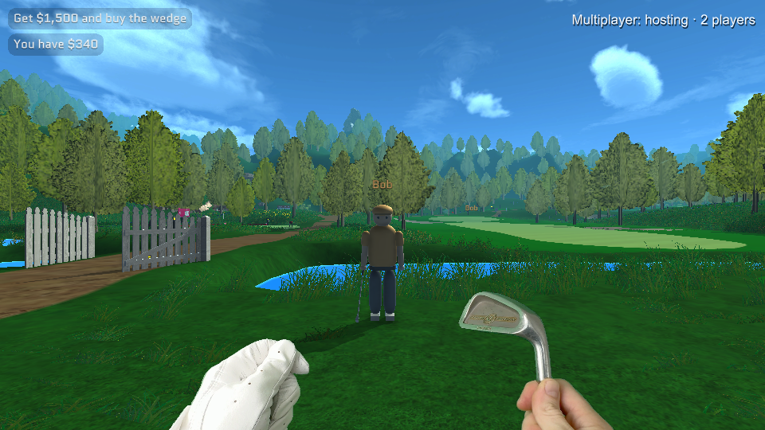
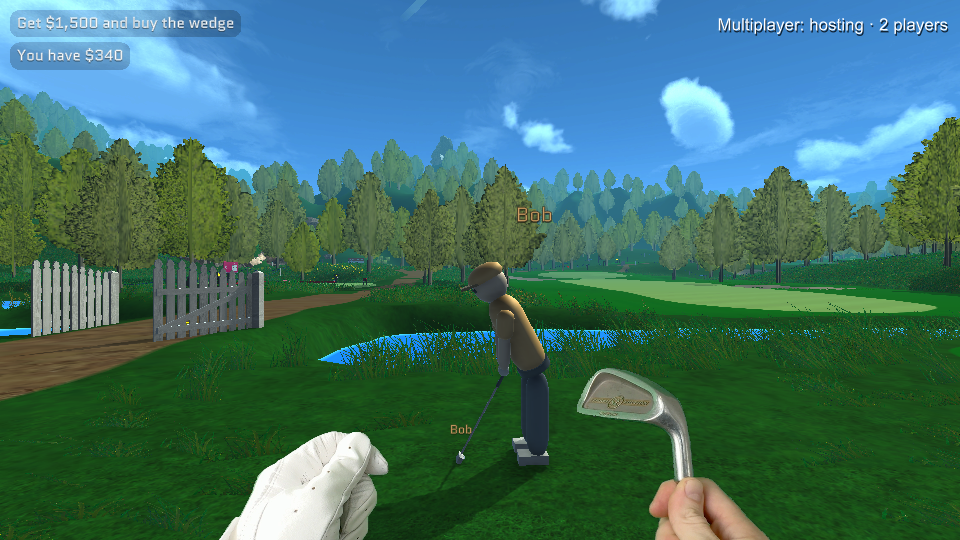
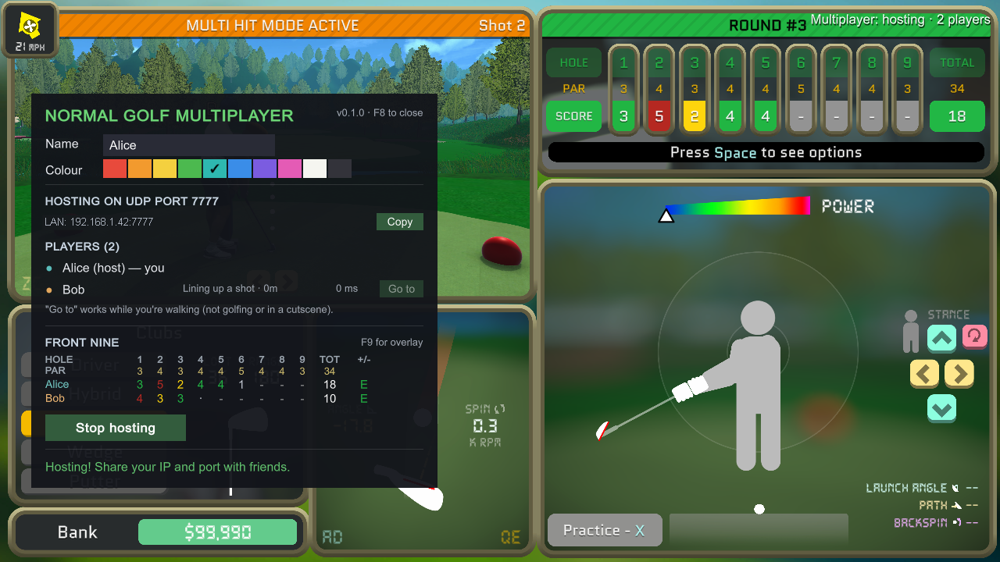

# Normal Golf Multiplayer

Play **Normal Golf Game** with friends. See each other walking the course, watch each other's swings, follow
each other's balls in flight, and compare Front Nine scorecards. You connect directly by IP address and port —
no accounts, no servers, no launcher.



**[Download the latest release](../../releases/latest)** · unofficial fan mod · public domain

---

## This mod was written by AI — please read this

Being upfront about it, because you deserve to know what you're installing:

**Every line of this mod was written by Claude (Anthropic's Claude Opus 5), running in Claude Code.** That
includes reverse-engineering the game, the networking, the player avatars, the UI, the scoreboard, these docs,
and the automated in-game testing. A human (the repo owner) directed the work, made the decisions, played it,
and confirmed it works — but did not hand-write the code.

What that means in practice:

* **Read the code before you trust it.** It's small, commented, and public domain. Nothing here phones home,
  collects anything, or touches files outside the game's own folders. The only network traffic is UDP between
  you and the people you choose to connect to.
* **It was genuinely tested, not just generated.** It was driven through real sessions with two and three
  copies of the game running side by side, plus normal play by the owner. See [what was tested](#whats-been-tested).
* **Bugs are expected**, especially on setups unlike the ones it was tested on. Please
  [open an issue](../../issues) rather than assuming it's you.
* **It's public domain** ([Unlicense](UNLICENSE)) — fork it, rewrite it, ship your own version, no credit
  needed. If AI-written code isn't for you, that's completely fair; this is the honest label rather than a sales pitch.

* **Repo owner here**, I really hope this is clear to the people who want to know this i personally wanted a multiplayer mod to enjoy with friends and its a lot of fun. I don't want this to be the normal multiplayer experience for this game and I'm sure something much better will come. I also hope this helps to show how far AI has come, and to a degree it's worrying and it was released without a license since i don't believe anyone should claim ownership over generated code. Lastly Ive heard there is a multiplayer mod being worked on so i feel i should say this is not affiliated with it.
---

## What it does

| | |
|---|---|
| **See each other** | Other players appear as golfers with name tags, walking, crouching and looking around |
| **Watch the shots** | Their address stance and swing are animated, timed to their real shot, with the club-hit sound placed in the world |
| **Follow every ball** | Each player's ball flies with a trail in their colour and a name marker so you can spot where it landed |
| **Front Nine scoreboard** | Everyone's card side by side: hole, par, and a row per player, with penalties counted the way the game counts them |
| **Chat & player list** | In-game chat, ping, distances, and a "Go to" button to teleport next to a friend |

Everyone keeps their own save, story progress and money — this adds people to your world, it doesn't merge saves.
Other players and their balls never collide with you, so nobody can ruin your shot.

<p align="center">
  
  
</p>

## Install

1. **Find the game folder.** In Steam: right-click Normal Golf Game → Manage → Browse local files, then open
   the **`Normal`** folder inside it — the one containing `Normal Golf Game.exe`.
2. **Extract the release zip into that folder**, so `winhttp.dll` sits right next to `Normal Golf Game.exe`.
3. **Start the game from Steam** as usual, and press **F8**.

The zip contains the mod plus [BepInEx](https://github.com/BepInEx/BepInEx), the loader that runs it.
Everyone playing together needs **the same version of the mod**; mismatched versions are refused with a message
telling you to update.

**Uninstalling:** delete `winhttp.dll` from that folder to switch all mods off, or also delete `BepInEx`,
`doorstop_config.ini`, `.doorstop_version` and `changelog.txt` to remove every trace.

**Compatibility:** built against game build *"Build 9:16AM September 21"* (Steam build `25426758`). A game update
can break parts of the mod until it's rebuilt; when that happens it degrades one feature and logs a warning rather
than crashing the game. Windows only for now — the loader files in the zip are the Windows build of BepInEx.

## Playing together

Press **F8** to open the multiplayer menu.

* **Host:** choose a port (default 7777) and optionally a password, then click **Host game**. Share your IP and port.
* **Join:** type the host's address and port (you can paste `1.2.3.4:7777` straight into the address box) and click **Join**.

### Same house or LAN

The host's LAN IP is shown right in the menu with a Copy button. Nothing else to set up.

### Over the internet

Only the **host** needs to do anything: forward **UDP port 7777** (or whichever port you pick) to the host's PC
in the router settings, then give friends the host's public IP (search "what is my ip"). Joining players need nothing.

Notes:
* The first time you host, Windows may ask whether the game can use the network — allow it, or nobody can reach you.
* Testing your own public IP from your own PC often fails even when it's working for everyone else; have a friend try it.
* If port forwarding isn't an option, a shared VPN such as Tailscale, ZeroTier or Radmin works without router changes,
  and whoever has the easiest router can host instead.

### Front Nine scoreboard

In Play Nine, press the red button at the first tee as usual. Everyone's card appears in the F8 menu and on the
**F9** overlay: hole, par, then a row per player, with totals and a score against par. The hole someone is on
shows their strokes so far in grey. Scores come from the game's own counters, so **water and retake penalties are
already included**, and skipped holes score par. A player's row resets when they start a new round, and stops
updating once they finish the ninth — everyone plays their own round at their own pace.

## Controls

| Key | |
|---|---|
| **F8** | Multiplayer menu: name, colour, host/join, player list, scoreboard |
| **F9** | Show/hide the scoreboard overlay while playing |
| **T** | Chat (Enter sends, Esc cancels) |

All of these are rebindable in `BepInEx\config\normalgolf.multiplayer.cfg`, which also holds your name, colour,
port, password, max players, name tags, remote sounds and the interpolation delay. The file appears after the
first launch.

## FAQ

**Does it work with the story mode?** Yes. You'll see each other anywhere on the course. Only the scoreboard is
specific to Play Nine.

**Can we play different modes at once?** Yes — one of you can be doing story bounties while another plays a round.

**Is my save at risk?** The mod never writes to your saves. It only reads the values it needs.

**Does this let me cheat / get achievements?** It doesn't change your game rules, physics or progression. Other
players are visual only.

**Someone's avatar is standing still / floating.** They're probably in a menu or loading. Avatars hide when a
player isn't on the course.

**It says "version mismatch".** Everyone needs the same release; grab the latest.

**Nobody can connect to me.** Check the port forward (UDP, same port as the menu shows), that Windows allowed
the game through the firewall, and that your friends are using your *public* IP rather than your LAN one.

## Building from source

You need the [.NET 8 SDK](https://dotnet.microsoft.com/download), the game, and BepInEx 5 installed in it.

```powershell
.\build.ps1      # builds and copies the DLLs into the game's BepInEx\plugins folder
.\package.ps1    # also produces dist\NormalGolfMultiplayer-v<version>.zip
```

The scripts find the game through your Steam libraries. If it isn't found, pass
`-GameDir "...\Normal Golf Game\Normal"`, set `NGMP_GAME_DIR`, or drop the path into a `game-path.txt` file.
Close the game before building — it locks the plugin DLL.

More detail: [docs/ARCHITECTURE.md](docs/ARCHITECTURE.md) (how it hooks into the game and why) and
[docs/TESTING.md](docs/TESTING.md) (running two copies on one PC and driving them automatically).

## What's been tested

Two and three copies of the game side by side on one PC, plus ordinary play by the owner:
joining, walking and animation, golf stances and swings, ball flight and trails in every camera view,
ball skins, hole-outs, chat, the menu, Play Nine, returning to the main menu and back, leaving and rejoining,
host shutdown, wrong passwords, unreachable hosts, three-player relaying, and the scoreboard
(live penalty strokes, a full nine-hole round, restarts, and a mid-round joiner).

Less tested: **play across separate machines over the internet**, and sessions larger than three players.
Reports welcome.

## Contributing

Issues and pull requests are welcome — see [CONTRIBUTING.md](CONTRIBUTING.md). Bug reports are most useful with
the `BepInEx\LogOutput.log` from everyone involved, and whether you were hosting or joining.

## Credits and licence

* The mod's own code is released into the **public domain** under the [Unlicense](UNLICENSE).
* Bundled in the release zip: [BepInEx](https://github.com/BepInEx/BepInEx) (LGPL-2.1) and
  [LiteNetLib](https://github.com/RevenantX/LiteNetLib) (MIT) — see [THIRD-PARTY-NOTICES.txt](THIRD-PARTY-NOTICES.txt).
  Those keep their own licences; the public-domain dedication covers this repository's source only.
* **Normal Golf Game** is by Luke Muscat. This is an unofficial fan mod, not affiliated with or endorsed by the
  developer. Please don't send mod problems their way — [open an issue here](../../issues) instead.
